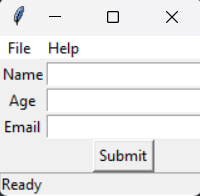

# Exercice 3 : Ajouter un menu et une barre d'état

## Objectif

Améliorer l'application en ajoutant un menu et une barre d'état.

## Instructions

1. Ouvrez le fichier corrigé de l'Exercice 2 correspondant au framework que vous utilisez :
   - Tkinter: [tkinter-solution.py](../2/tkinter-solution.py)
   - PySide6: [pyside6-solution.py](../2/pyside6-solution.py)
2. Ajoutez un menu avec les options suivantes :
   - `File` contenant une option `Quit` pour fermer l'application.
   - `Help` contenant une option `About` pour afficher un message d'information.
3. Ajoutez une barre d'état pour afficher un message par défaut.

    

## Solutions

- [Solution Tkinter](./tkinter-solution.py)
- [Solution PySide6](./pyside6-solution.py)
