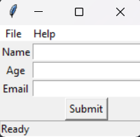

# Exercise 3: Add a Menu and a Status Bar

## Objective

Enhance the application by adding a menu and a status bar.

## Instructions

1. Open the corrected file from Exercise 2 for the framework you are using:
   - Tkinter: [tkinter-solution.py](../2/tkinter-solution.py)
   - PySide6: [pyside6-solution.py](../2/pyside6-solution.py)
2. Add a menu with the following options:
   - `File` containing a `Quit` option to close the application.
   - `Help` containing an `About` option to display an information message.
3. Add a status bar to display a default message.

    

## Solutions

- [Tkinter Solution](./tkinter-solution.py)
- [PySide6 Solution](./pyside6-solution.py)
